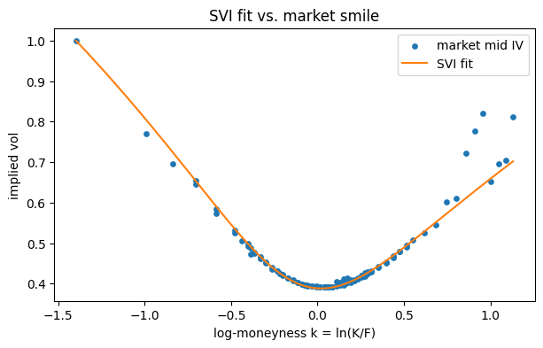
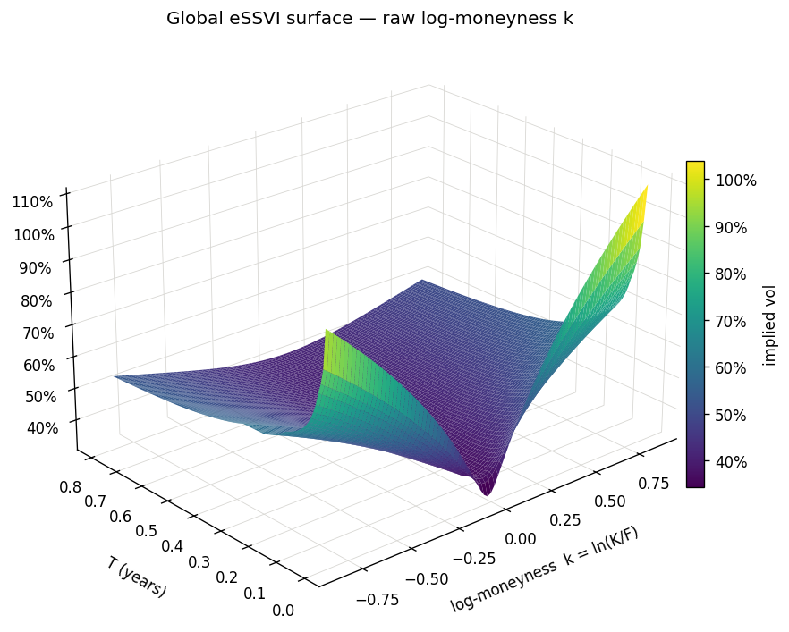
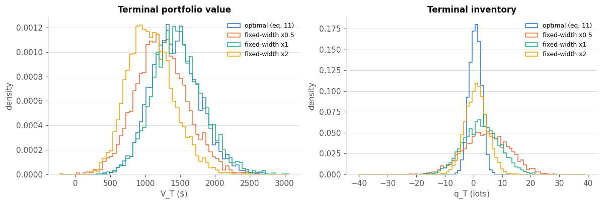

# Option Market Making with Arbitrage-Free Volatility Surface

## No arbitrage eSSVI volatility surface

Maturity is denoted $\tau$ throughout;
$k = \ln(K/F(\tau))$ is log-forward-moneyness, and total variance is
$w(k,\tau) = \sigma_{\text{impl}}(k,\tau)^2\tau$.

### 1. SVI

One slice per maturity $\tau$, fitted independently, 5 parameters each (Gatheral 2013):

$$
w(k;\tau) = a(\tau) + b(\tau)\Big(\rho(\tau)(k-m(\tau)) + \sqrt{(k-m(\tau))^2 + \sigma(\tau)^2}\Big)
$$

The SVI 5-parameter fit is not arbitrage-free constrained, so on live data it can land in an optimal curve that violates butterfly arbitrage 

### 2. Global eSSVI

Writing $\psi(\tau) := \theta(\tau)\varphi(\tau)$,

$$
\text{eSSVI}(k;\tau) = \frac{1}{2}\Big[\theta(\tau) + \rho(\tau)\psi(\tau) k + \sqrt{\big(\psi(\tau)k+\theta(\tau)\rho(\tau)\big)^2 + \theta(\tau)^2\big(1-\rho(\tau)^2\big)}\Big]
$$

with $\rho(\tau)$ now free to vary by maturity — the extension over SSVI's single shared
$\rho$. For a discrete term structure $\tau_1 < \tau_2 < \dots < \tau_N$, write
$(\theta_i,\rho_i,\psi_i) := (\theta(\tau_i),\rho(\tau_i),\psi(\tau_i))$, $3N$ parameters
total.

The key idea (Mingone 2022): rather than fit-then-check, the admissible region
is **reparametrized as an open hyperrectangle**

$$
\rho_i \in (-1,1), \quad \theta_1 \in (0,\infty), \quad a_i \in (0,\infty), \quad c_i \in (0,1), \qquad i =1,2,\ldots,N.
$$

with an explicit bijection (`unbox`) onto every arbitrage-free surface (Proposition 3.1).
Calibration becomes ordinary box-constrained least squares on option **prices** — every
point the optimizer can visit is already arbitrage-free, so there is nothing to check
afterward.

## Option Market Making and Volatility Arbitrage

Given a market maker who provides quotes for a European call option with strike $K > 0$, maturity $\tau > 0$ and $`(S_t)_{t \ge 0}`$ being the price process of the underlying risky asset. From the perspective of the market maker, $`(S_t)_{t \ge 0}`$ has the dynamics:
$`\mathrm{d}S_t/S_t = \sigma_t\mathrm{d}B_t`$,
where $B_t$ is a standard one-dimensional Brownian motion. The market maker does not have any view on the (short-term) asset drift, while $`(\sigma_t)_{t \ge 0}`$ is their subjective assessment of the asset volatility process.

**Objective.** The quotes are not chosen to maximize expected P&L; they
maximize P&L net of the cost of carrying inventory the market making period $[0,T]$ with $T\in (0,\tau)$:

$$\arg\max \mathbb{E}\Big[V_T - \beta\int_0^T Q_u^2du - \alpha Q_T^2 \Big]$$

where $V_T$ is the market maker's total portfolio value at the close, $Q_t$ is the market maker's option inventory at time $t$ (how many lots of the option they're currently holding) and $\alpha, \beta$ are two penalty parameters that controls the risk level at the end of a trading period
and the intraday risk exposure throughout the entire duration of
the market-making, respectively.

The optimal bid/ask half-spreads (eq. 11) are:

$$\delta^{b,*}(t,s,q) = \underbrace{\frac{1}{\kappa^b}}_{\text{liquidity}} - \underbrace{\psi_1(t,s)}_{\text{vol-arb edge + order-flow}} - \underbrace{(2q+1)\psi_2(t)}_{\text{inventory control}}$$

$$\delta^{a,*}(t,s,q) = \underbrace{\frac{1}{\kappa^a}}_{\text{liquidity}} + \underbrace{\psi_1(t,s)}_{\text{vol-arb edge + order-flow}} + \underbrace{(2q-1)\psi_2(t)}_{\text{inventory control}}$$

$\psi_1(t,s) = \varphi(t,s) + \text{order-flow}$ is the maker's edge: $\varphi \propto (\sigma^2 -\sigma^2_{\text{imp}})$
the difference of variances between the maker's believed volatility and the market-implied volatility, with $\sigma^2_{\text{imp}}(K,\tau)$ is sourced from the calibrated eSSVI implied volatility surface, weighted by the option's dollar gamma and discounted by the kernel $D(t,u)\approx e^{-\eta(u-t)}$. Here
$\psi_2(t) < 0$ is the inventory weight — $𝑞$ does not change the total quoted width, only how it's split between bid and ask.

## Results

### SVI and eSSVI

**Per-expiry SVI fit against the live market smile:**

**Global eSSVI surface fit across all expiries at once:**

**Benchmark all three surfaces:**

Both fitted to one 273-quote OTM chain,
scored on every quote — including maturities a model declined to fit. Error per quote:

$$e_i = \big|\sigma^{\text{model}}(K_i,\tau_i) - \sigma^{\text{market}}_i\big|, \qquad
\text{half-spread}_i = \frac{(\text{ask}_i-\text{bid}_i)/2}{\text{vega}_i}$$

(half the market's own bid-ask, converted from price to vol points via vega — a
model landing inside that band is indistinguishable from correct).

| Model | Params | Expiries Fitted | Median \|dvol\| | Mean | P90 | Inside Bid-Ask |
|---|:---:|:---:|:---:|:---:|:---:|:---:|
| **SVI + interpolate** | 40 | 8 | 0.150% | 0.618% | 2.112% | 71% |
| **SSVI** | 13 | 10 | 1.012% | 2.057% | 5.389% | 32% |
| **Global eSSVI** | 30 | 10 | 0.156% | 0.348% | 0.523% | 88% |

**Verdict: Global eSSVI.** SVI's median is slightly better, but it comes from dropping the
one maturity it can't fit without arbitrage — and its `p90   and `inside bid-ask` are both worse than eSSVI's results. **eSSVI fits every maturity,
wins the columns that matter for a surface meant to be trusted rather than re-checked, and
carries no arbitrage risk by construction.**

-----

### Optimal Market Making policy

**Vol-arb quoting policy: terminal PnL and inventory vs. fixed-width quoting baselines:**

**Benchmark.** Against a "fixed-width" quoter that ignores inventory and
the vol view entirely, the fixed-width rule can earn *more* raw P&L
($1,472 vs $1,431) since it never turns down a favorable trade to manage
risk — but scored on the actual objective above, the optimal rule wins
decisively (it pays $47 in inventory-risk cost for that P&L vs. the
fixed-width rule's $289, finishing $202 ahead net).

## References

- Gatheral, J., & Jacquier, A. (2013). [Arbitrage-free SVI volatility surfaces](https://arxiv.org/abs/1204.0646). *Quantitative Finance*, arXiv:1204.0646. — raw SVI, the butterfly/calendar no-arbitrage conditions, and the SSVI parametrization (`svi.py`, `arbitrage.py`, `ssvi.py`).
- Mingone, A. (2022). [No arbitrage global parametrization for the eSSVI volatility surface](https://arxiv.org/abs/2204.00312). arXiv:2204.00312. — the box reparametrization that makes eSSVI calibration arbitrage-free by construction (`global_essvi.py`).
- Lucic, V., & Tse, A. S. L. (2025). Option market-making and vol arbitrage. *Risk.net*. (Working paper title: *Optimal option market making and volatility arbitrage*.) — the quoting model implemented in `option_market_making/` and explored in `option_mm_vol_arbitrage.ipynb`.

